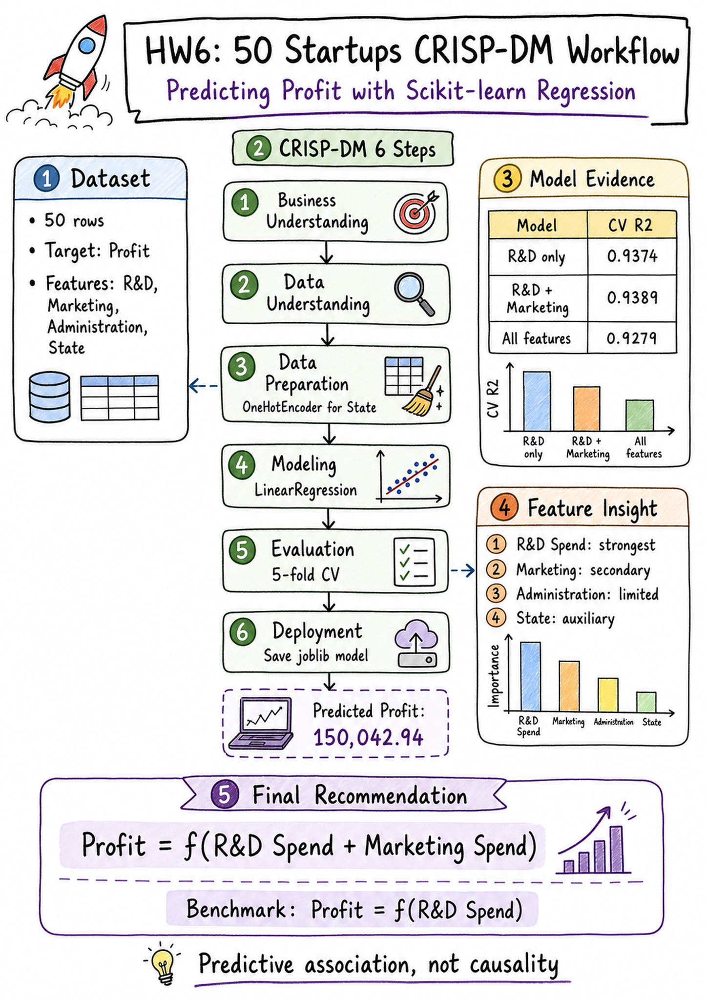
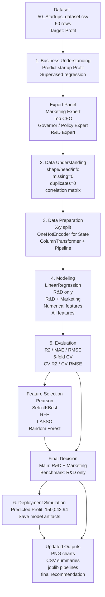

# HW6 - Kaggle 50 Startups CRISP-DM Final Report

## 1. Project Goal

This project uses the Kaggle 50 Startups dataset to predict startup `Profit`
from business spending variables:

- `R&D Spend`
- `Administration`
- `Marketing Spend`
- `State`

The task is a supervised learning regression problem. The workflow follows the
six CRISP-DM steps: Business Understanding, Data Understanding, Data
Preparation, Modeling, Evaluation, and Deployment.

## 2. Complete Workflow Diagram

Excalidraw-style A4 portrait infographic:

[hw6_crispdm_excalidraw_infographic_a4_2k_upscaled.png](outputs/hw6_crispdm_excalidraw_infographic_a4_2k_upscaled.png)



Draw.io source file:

[hw6_crispdm_workflow.drawio](hw6_crispdm_workflow.drawio)

Mermaid preview:



## 3. Final Recommendation

Use this as the final main model:

```text
Profit = f(R&D Spend, Marketing Spend)
```

Keep this as the simplest benchmark model:

```text
Profit = f(R&D Spend)
```

Reason:

- `R&D Spend` is the strongest predictor across correlation, SelectKBest, RFE,
  LASSO, Random Forest, train-test evaluation, and cross-validation.
- `Marketing Spend` adds only a small CV R2 improvement, but it has important
  business meaning because it represents market expansion, customer acquisition,
  and brand exposure.
- `Administration` was tested but did not improve model performance.
- `State` was tested with One-Hot Encoding but did not add meaningful value in
  this small 50-row dataset.
- The full model is not recommended because more features reduced performance
  and weakened interpretability.

## 4. Updated Model Evidence

| Model | Test R2 | Test RMSE | CV R2 Mean | Decision |
|---|---:|---:|---:|---|
| R&D only | 0.9265 | 7714.33 | 0.9374 | Best simple benchmark |
| R&D + Marketing | 0.9168 | 8206.33 | 0.9389 | Final recommended model |
| Numerical Features | 0.9001 | 8995.91 | 0.9338 | Not selected |
| All Features | 0.8987 | 9055.96 | 0.9279 | Not selected |

## 5. Expert Consensus

Marketing Expert:
R&D creates the product value, while Marketing helps bring that value to the
market. Marketing should remain in the main model for business interpretation,
even though the incremental lift over R&D alone is small.

Top CEO:
The model must be explainable in a business meeting. `R&D + Marketing` gives the
best balance between performance, simplicity, and decision usefulness.

Governor / Regional Policy Expert:
`State` is not selected because the dataset has only 50 rows and limited samples
per state. This does not prove regional policy is unimportant; it means this
dataset is too small to support strong regional conclusions.

R&D Expert:
R&D must remain the core variable. The evidence consistently shows that product
innovation and technical capability are the strongest signals associated with
Profit.

## 6. Updated Technical Charts

| Chart | File |
|---|---|
| Pearson Correlation | [01_pearson_correlation.png](outputs/algorithm_charts/01_pearson_correlation.png) |
| SelectKBest F Scores | [02_selectkbest_f_scores.png](outputs/algorithm_charts/02_selectkbest_f_scores.png) |
| RFE Selection Strength | [03_rfe_selection_strength.png](outputs/algorithm_charts/03_rfe_selection_strength.png) |
| LASSO Coefficient Path | [04_lasso_coefficient_path.png](outputs/algorithm_charts/04_lasso_coefficient_path.png) |
| Random Forest Importance | [05_random_forest_importance.png](outputs/algorithm_charts/05_random_forest_importance.png) |
| Model Subset Curves | [06_model_subset_curves.png](outputs/algorithm_charts/06_model_subset_curves.png) |
| Actual vs Predicted | [07_actual_vs_predicted.png](outputs/algorithm_charts/07_actual_vs_predicted.png) |
| Residual Analysis | [08_residual_analysis.png](outputs/algorithm_charts/08_residual_analysis.png) |

## 7. Updated Data and Artifacts

| Artifact | File |
|---|---|
| Final recommendation | [final_recommendation_updated.md](outputs/final_recommendation_updated.md) |
| V1/V2 expert discussion | [v1_v2_expert_discussion_final_recommendation.md](outputs/v1_v2_expert_discussion_final_recommendation.md) |
| Technical results summary | [updated_technical_results_summary.csv](outputs/updated_technical_results_summary.csv) |
| Chart index | [updated_chart_index.csv](outputs/updated_chart_index.csv) |
| Model subset comparison | [model_subset_comparison.csv](outputs/model_subset_comparison.csv) |
| Pearson correlation data | [pearson_correlation.csv](outputs/pearson_correlation.csv) |
| SelectKBest scores | [selectkbest_scores.csv](outputs/selectkbest_scores.csv) |
| RFE ranking | [rfe_ranking.csv](outputs/rfe_ranking.csv) |
| LASSO coefficients | [lasso_coefficients.csv](outputs/lasso_coefficients.csv) |
| Random Forest importance | [random_forest_importance.csv](outputs/random_forest_importance.csv) |
| 20-slide voice narration plan | [hw6_20_slide_voice_narration_plan.md](outputs/hw6_20_slide_voice_narration_plan.md) |
| 20-slide voice narration CSV | [hw6_20_slide_voice_narration_plan.csv](outputs/hw6_20_slide_voice_narration_plan.csv) |
| 20-slide PowerPoint with notes | [hw6_50_startups_crispdm_20_slides_with_notes.pptx](outputs/hw6_50_startups_crispdm_20_slides_with_notes.pptx) |
| 20-slide voice-over script | [hw6_20_slide_voiceover_script.txt](outputs/hw6_20_slide_voiceover_script.txt) |
| PowerPoint generator script | [make_hw6_ppt.py](make_hw6_ppt.py) |
| Final pipeline | [startup_profit_pipeline.joblib](outputs/startup_profit_pipeline.joblib) |
| V1 model | [startup_profit_model_v1.pkl](startup_profit_model_v1.pkl) |
| V2 model | [startup_profit_model_v2.pkl](startup_profit_model_v2.pkl) |

## 8. Final Statement

The final recommendation is to use `R&D Spend + Marketing Spend` as the main
explainable prediction model and keep `R&D Spend` alone as the benchmark. The
results should be described as predictive associations, not causal conclusions,
because the dataset is observational and contains only 50 records.
